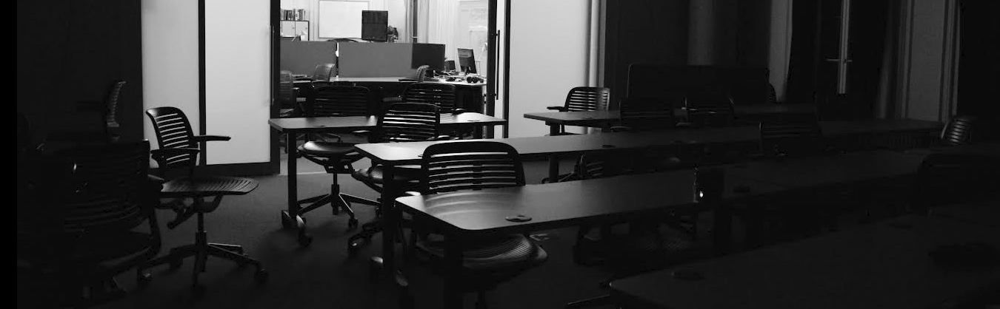

# This is heading 1
## This is heading 2
### This is heading 3
#### This is heading 4
##### This is heading 5
###### This is heading 6

[This is a link](#)

> This is a blockquote

`This is code`

### Bullet List
* Item 1
* Item 2
* Item 3
* Item 4

### Number List
1. Item 1
2. Item 2
3. Item 3
4. Item 4

### Revelant Literature
* [Mathematics of the discrete fourier transform (DFT) with audio applications](https://ccrma.stanford.edu/~jos/st/)
* [Spectral audio signal processing](https://ccrma.stanford.edu/~jos/sasp/)
* [Digital signals theory](https://brianmcfee.net/dstbook-site/content/intro.html)
* [DDSP: differentiable digital signal processing](https://arxiv.org/pdf/2001.04643)
* [F0 analysis of Ghanaian pop singing reveals progressive alignment with equal temperament over the past three decades: a case study](https://ccrma.stanford.edu/~iran/papers/Roman_et_al_SMC_2023.pdf)
* [EGFxSet: electric guitar tones processed through real effects of distortion, modulation, delay and reverb](https://ccrma.stanford.edu/~iran/papers/Pedroza_et_al_ISMIR_2022.pdf)
