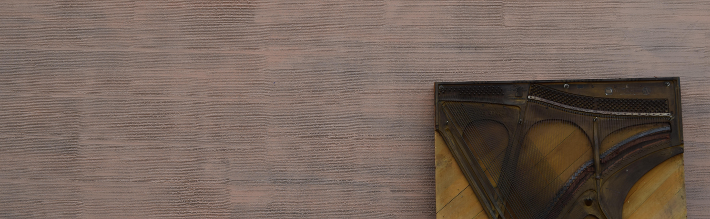

# Differentiable Digital Signal Processing

## Day 1 (Monday): The Discrete Fourier Transform  

### Lecture Topics:  
* Digital audio signal  
* Discrete Fourier Transform  
* Inverse Discrete Fourier Transform  
* Short Time Fourier Transform  

### Lecture Notes:  
* [Signal sampling & DFT](https://githubtocolab.com/ccrma-mir/course-materials/blob/main/CCRMA_DDSP_Workshop_Notes-Day_1.ipynb) 

### Guest Speaker:  
* Julius O. Smith - Spectral Audio Signal Processing

## Day 2 (Tuesday): Digital Filter Theory  

### CCRMA Tour

### Lab Session:
* Data prep for [DESREO](https://github.com/iranroman/DESREO)

### Lecture Topics:  
* Convolution
* Finite Impulse Response Filters

## Day 3 (Wednesday): Torch Dataloaders and IIR Filters  

### Lecture Topics:
* Infinite Impulse Response Filters
* Z Transform  

### Lecture Notes:  
* [Digital filters](https://githubtocolab.com/ccrma-mir/course-materials/blob/main/CCRMA_DDSP_Workshop_Notes_Day_3.ipynb) 

### Lab Session:
* [Data loader for DESREO](https://github.com/iranroman/DESREO/blob/main/desreo/datasets/snoop_dogg.py)

## Day 4 (Thursday): Onset, Beat, and Pitch Tracking

### Lecture Topics:  
* Onset Detection
* Tempo Analysis
* Beat Tracking  

### Lecture Notes:  
* [Onset, tempo, and beat](https://githubtocolab.com/ccrma-mir/course-materials/blob/main/CCRMA_DDSP_Workshop_Notes_Day_4.ipynb)

### Reading:  
* F0 Analysis of Ghanaian Pop Singing Reveals Progressive Alignment with Equal Temperament Over the Past Three Decades: A Case Study  
* Convolutional Representation for Pitch Estimation

## Day 5 (Friday): Chord and Music Representations

### Lecture Topics:  
* Chroma Feature
* Chord Recognition
* Hidden Markov Models  

### Lecture Notes:  
* [Chroma and HMM](https://githubtocolab.com/ccrma-mir/course-materials/blob/main/CCRMA_DDSP_Workshop_Notes_Day_5.ipynb)

### Guest Speaker:
* Hegel Pedroza, Gerardo Meza - EGFxSet: Electric Guitar Tones Processed Through Real Effects of Distortion, Modulation, Delay and Reverb  

## Revelant Literature

[Mathematics of the discrete fourier transform (DFT) with audio applications](https://ccrma.stanford.edu/~jos/st/)

[Spectral audio signal processing](https://ccrma.stanford.edu/~jos/sasp/)

[Digital signals theory](https://brianmcfee.net/dstbook-site/content/intro.html)

[Fundamentals of music processing](https://www.audiolabs-erlangen.de/fau/professor/mueller/bookFMP)

[DDSP: differentiable digital signal processing](https://arxiv.org/pdf/2001.04643)

[F0 analysis of Ghanaian pop singing reveals progressive alignment with equal temperament over the past three decades: a case study](https://ccrma.stanford.edu/~iran/papers/Roman_et_al_SMC_2023.pdf)

[EGFxSet: electric guitar tones processed through real effects of distortion, modulation, delay and reverb](https://ccrma.stanford.edu/~iran/papers/Pedroza_et_al_ISMIR_2022.pdf)
