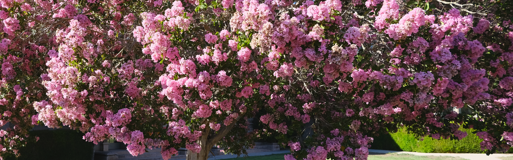

# Deep Learning for Music Information Retrieval

## Day 1 (Monday)
* Reading: [Automatic Identification of Instrument Classes in Polyphonic and Poly-instrument Audio](https://citeseerx.ist.psu.edu/viewdoc/download?doi=10.1.1.205.9461&rep=rep1&type=pdf)

## Day 2 (Tuesday)

## Day 3 (Wednesday)
* Guest speaker talk by [Valerio Velardo](https://valeriovelardo.com/):

  - [The Sound of AI accelerator](https://thesoundofai.com/accelerator.html)

## Day 4 (Thursday)

## Day 5 (Friday)

## Day 6 (Monday)
* [RAVE](https://arxiv.org/pdf/2111.05011.pdf)
* Guest speaker talk by [Daniel Faronbi](https://danielfaronbi.com):

  - [Exploring Approaches to Multi-Task Automatic Synthesizer Programming](https://ccrma.stanford.edu/~iran/papers/Faronbi_et_al_ICASSP_2023.pdf)

## Day 7 (Tuesday)
* [Contrastive Audio-Language Learning for Music](https://arxiv.org/pdf/2208.12208.pdf)
* [Wav2CLIP](https://arxiv.org/pdf/2110.11499.pdf)
* [CLIPcap](https://arxiv.org/pdf/2111.09734.pdf)

## Day 8 (Wednesday)
* [Sound of Pixels](https://openaccess.thecvf.com/content_ECCV_2018/papers/Hang_Zhao_The_Sound_of_ECCV_2018_paper.pdf)
* [How to Listen? Rethinking Visual Sound Localization](https://arxiv.org/pdf/2204.05156.pdf)
* [Flowgrad](https://ieeexplore.ieee.org/iel7/10094559/10094560/10094965.pdf)
* Guest speaker talk by [Adrian S. Roman](https://adriansroman.github.io/adriansroman/):

  - 

## Day 9 (Thursday)
*
*

## Day 10 (Friday)
* Guest speaker talk by [Giovana Morais](https://giovana-morais.github.io):

  - [Tempo vs. Pitch: Understanding Self-supervised Tempo Estimation](https://ieeexplore.ieee.org/iel7/10094559/10094560/10095292.pdf)
  
* Workshop participant final presentations
