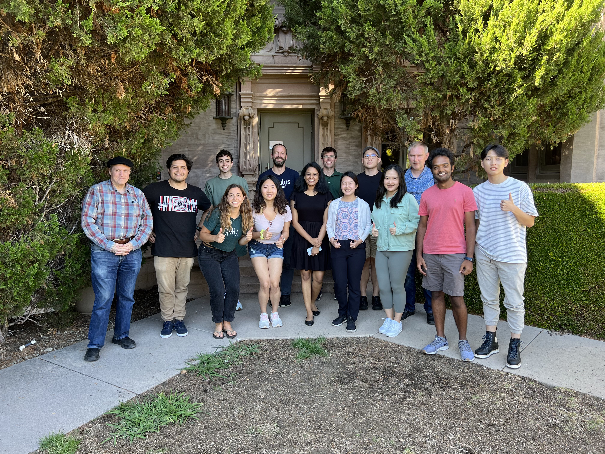
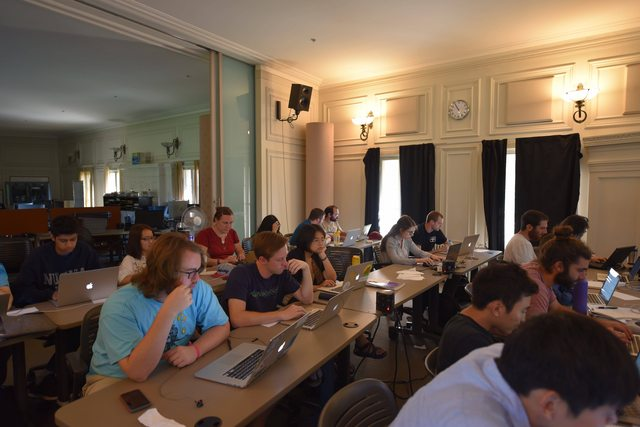

# 2023

DL4MIR Instructors: Iran R. Roman & Bea Steers

DDSP Instructors: Iran R. Roman & Chuyang Chen

# 2022

Instructors: Iran R. Roman & Camille Noufi

# 2021

Instructors: Iran R. Roman & Elena Georgieva

# 2018

Instructors: Iran R. Roman & Kitty Shi

# 2017

Instructor: Iran R. Roman

TAs: Anish Nag & Ankita Mitra
