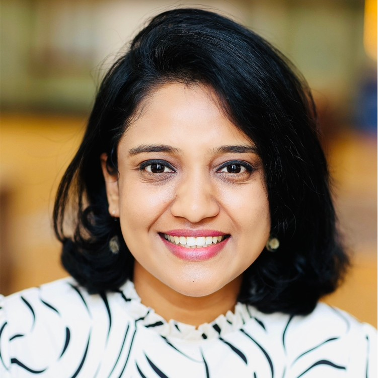
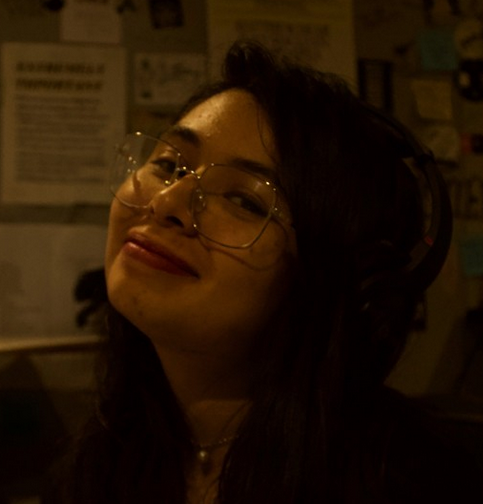
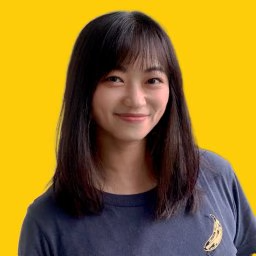
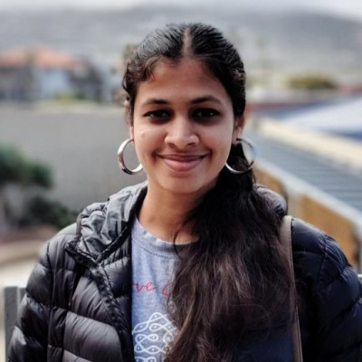
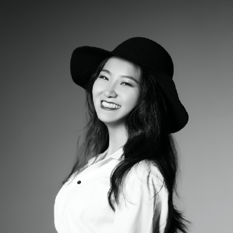

# 2022

    

        

            <figure class="image">
                
            </figure>
        

        

            
Sonam Bagul

        

    

    

        

            <figure class="image">
                
            </figure>
        

        

            
Nancy Rico-Mineros

        

    

# 2018

    

        

            <figure class="image">
                
            </figure>
        

        

            
Beici Liang

        

    

    

        

            <figure class="image">
                
            </figure>
        

        

            
Jose Giraldo

        

    

    

        

            <figure class="image">
                
            </figure>
        

        

            
Alice Baird

        

    

    

        

            <figure class="image">
                
            </figure>
        

        

            
Varsha Sankar

        

    

# 2017

    

        

            <figure class="image">
                
            </figure>
        

        

            
Tali Singer

        

    

    

        

            <figure class="image">
                
            </figure>
        

        

            
Jeff Trevino

        

    

    

        

            <figure class="image">
                
            </figure>
        

        

            
Jyoti Narang

        

    

    

        

            <figure class="image">
                
            </figure>
        

        

            
Xueqi Zhang

        

    

    

        

            <figure class="image">
                
            </figure>
        

        

            
Adi Etsion

        

    

Dear Scholars, please get in touch with Iran (iran <at> ccrma.stanford.edu) if you would like us to add a short bio you to your profile.
